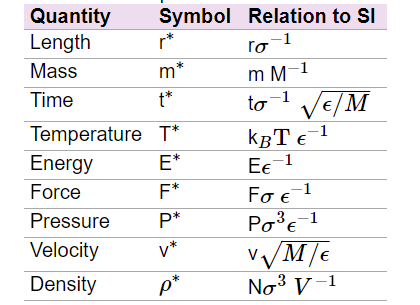

# Weekly progress journal

## Instructions

In this journal you will document your progress of the project, making use of the weekly milestones.

Every week you should

1. write down **on the day of the lecture** a short plan (bullet list is sufficient) of how you want to
   reach the weekly milestones. Think about how to distribute work in the group,
   what pieces of code functionality need to be implemented.
2. write about your progress **until Sunday, 23:59** before the next lecture with respect to the milestones.
   Substantiate your progress with links to code, pictures or test results. Reflect on the
   relation to your original plan.

We will give feedback on your progress on Tuesday before the following lecture. Consult the
[grading scheme](https://computationalphysics.quantumtinkerer.tudelft.nl/proj1-moldyn-grading/)
for details how the journal enters your grade.

Note that the file format of the journal is *markdown*. This is a flexible and easy method of
converting text to HTML.
Documentation of the syntax of markdown can be found
[here](https://docs.gitlab.com/ee/user/markdown.html#gfm-extends-standard-markdown).
You will find how to include [links](https://docs.gitlab.com/ee/user/markdown.html#links) and
[images](https://docs.gitlab.com/ee/user/markdown.html#images) particularly
useful.

## Week 1
(due 14 February 2021, 23:59)

For the following discussion, we refer to the functions found in the file skeleton.py. During the first week we worked on:

* **Initialize the system with positions corresponding to an fcc lattice.**

We created a function fcc_lattice(lx, ly, lz, lat_const) that generates a 3D fcc lattice that repeats the unit cell lx, ly, lz times along each axis X, Y, Z, respectively. Then, the number of atoms is not specified as a parameter, but rather derived as n_{atoms} = 4 lx, ly, lz. We found that for this case the dynamics of the atoms is difficult to follow graphically (with the current simulation), then we decided to consider a 2D square lattice created with the function square_lattice. Below it is shown a square lattice in which the simulation was performed.

* **Initialize the velocities according to a Gaussian distribution depending on the unitless temperature.**

This function was implemented using the numpy normal distribution function. However, the expression for the temperature we used so far is wrong. For the 2D case, the velocities along the Z axis will always be zero.

* **Implement the Lennard Jones potential between particles.**

The LJ potential was implemented along with the LJ force without any difficulty. Image of both is shown below.

* **Implement the Euler algorithm for the evolution of positions and velocities.**

We created a function called euler_evolution(init_pos, init_vel, step, number_steps) that returns the evolution of the positions and velocities in two lists ordered as (atom, coordinate, time). This function works for the 2D and 3D case. For the first one, we needed to include the method np.nan_to_num(velocities) since the velocity along Z is 0. Below the evolution of the positions for 50 steps of simulation with step 0.0005.

* **Periodic BC

Example of 2 particles on 2d space

* **Total energy function

The  implementation of the energy functions can be observed in the results from next week.
## Week 2
(due 21 February 2021, 23:59)

We note that we have finished the remaining week 1 task which was implementing the periodic boundary condition, which was easily achieved by introducing modulo to the Euler algorithm expressions.

* **Derive the expression of the kinetic energy in dimensionless/reduced units**

In deriving the expression of the kinetic energy in reduced units, we used the following conversion table retrieved from: https://arxiv.org/ftp/arxiv/papers/1908/1908.00601.pdf.

From this, we arrived at:

* **Change your existing molecular dynamics simulation to now use dimensionless units**

Similarly, we used the conversion table above to derive our expression for the expressions in Euler algorithm in reduced units:

* **Implement the minimal image convention**

As shown in lecture notes of [week 2](https://compphys.quantumtinkerer.tudelft.nl/proj1-moldyn-week2/), we implemented the nearest mirror image method in order to deal with the **[Periodic Boundary Condition (PBC)](https://en.wikipedia.org/wiki/Periodic_boundary_conditions)** of our simulation:

Intuitively, one would think that we would need to check for 27 images (in the 3 dimensional case), and for each of the 27 cases... for each pair of N-particles! That would be very tedious to implement!

Fortunately, with the algorithm shown above, all of these can be done in a single line of code (with the help of [Numpy](https://numpy.org/) broadcasting/vector-wise operation feature) efficiency.

* **Simulate 2 atoms in 3D space. Choose their initial positions close to the boundary. This way, you can clearly see if the periodic boundary conditions work. Plot their inter-atom distance over time. Furthermore, also plot the kinetic and potential energy, as well as their sum, over time.**

For the purpose of testing the special case where 2 atoms are near the border of our simulation domain, we created a function called **make_2_particles_3d_diag()** in **lattice.py**, which creates two atoms at (0.08, 0.08, 0.08) and (0.92, 0.92, 0.92) in Cartesian coordinates.

 function")

By referencing a post from **[StackOverFlow](https://stackoverflow.com/questions/46325447/animated-interactive-plot-using-matplotlib)**, we created a python file **slider_plot.py** that contains interactive plotting function for ease of visualising our Molecular Dynamics (MD) simulation.

Below is a static image of the visualisation of the MD simulation **with initial velocities equals to zero** at an early time step together with the relative distance plot and total energy plot (where x-axis denotes time):

As expected, the atoms are indeed at the diagonal corners of the simulation domain. Now, we show the same simulation at a much later time step (as indicated by the slider bar):

We see that indeed the particles repel each other as if there are *mirror* images at the diagonal corner of the simulation domain. This shows that the **minimal image convention** implementation worked as intended.

Furthermore, we see that the relative distance of the two particles from each other's perspective is equivalent. Thus, no problem there.

In the energy plots however, we notice some weird behaviour.

In the top right plot, we see that the total energy remains around 0 as it should be since the initial velocities of the 2 atoms are 0. In the bottom right plot, we zoom in on the y-axis (energy) and see that the contribution mainly came from the **potential energy**, which intuitively makes sense since the particles are near each other.

The weird behaviour may have came from an undetected bug in our code, or it may have been an **inherent limitation** of the **Euler algorithm**. We hope to fix the weird total energy behaviour as discussed in this week in the upcoming weeks and perhaps introduce further optimisations and code tidying-up.

## Week 3
(due 28 February 2021, 23:59)

* **Rectifying the dimensionless conversion. & Implement the velocity-Verlet algorithm.**

In week 2, we mentioned that we used a conversion table from this [**arxiv paper**](https://arxiv.org/ftp/arxiv/papers/1908/1908.00601.pdf). However, we realised that this conversion table is erroneous.
Thus, we **rectified the errors** in our code due to the erroneous conversion by using the table from [*GROMACS' documentation*](https://manual.gromacs.org/documentation/2019/reference-manual/definitions.html) instead.

After rectifying the evolution expressions, we get the following expression for the **Euler** algorithm. In the same figure, we also showed the expression for the **Verlet** algorithm in reduced units.

These algorithm can be found implemented in **euler.py** and **verlet.py** in our repository.

* **Extend your code to more than 2 particles.**

The code that we implemented is already **generalised** for **N-particles** to from the get-go, so we did not have to make additional effort this week for this point. Here we show an example,

Example of 4 particles on 2d space

* **Investigate the conservation of energy in the system. Plot the evolution of the kinetic and potential energy, as well as their sum.**

We have found that the kinetic and potential energy have an oscillatory behaviour for the two particle cases. The obtained results are shown in the following figure.

* **Compare the results of energy conservation using the Euler and Verlet algorithms.**

We have found that the total energy has an oscillatory behaviour. For the Euler algorithm, the amplitude of such oscilations decreases in time, while for the Verlet algorithm, it grows in time.

* **Make an initial attempt to structure your code properly. You can start from the example structure we included in your repository.**

The organized version of the code can be found in the directory `molecular_dynamics_simulation/`. The structure of the files is the following,

   molecular_dynamics_simulation
   |
   ├── euler_tk_2.py
   ├── euler_verlet.ipynb
   ├── examples
   │   ├── example.py
   │   ├── __init__.py
   │   └── run_mpl.py
   ├── __init__.py
   ├── run_mpl.py
   ├── simulation
   │   ├── euler.py
   │   ├── __init__.py
   │   ├── lattices.py
   │   ├── LJ_forces.py
   │   └── verlet.py
   ├── verlet_tk_2.py
   └── visualization
      ├── __init__.py
      ├── mpl_plots.py
      ├── slider_plot.py
      └── tk_animation.py

All the code related to simulation and execution is in `simulation/` while all the code related to plots and animations in in `visualization/`. The files `__init__.py` import the code in the directory where they are located such that all of it can be imported in a single line, instead of importing each separate file. Now we are planing to organize all examples (2d, 3d, 2 particles, 4 particles) in the directory `examples/`. However, to import the simulation modules from that directory requires more complex solution, in which we will work next week.

## Week 4
(due 7 March 2021, 23:59)

* **Implement the initialization of positions onto an fcc lattice.**

We have used an iterative approach to create a FCC lattice. It is used as `fcc_lattice(lx, ly, lz, a)` where $l_i$ is the number of unit cells repeated along the $i$-th coordinate, and $a$ is the lattice constant. Here we show two lattices with parameters $l_i=2$ and $l_i=6$ where $i=x,y,z$.

* **Show that the initial velocities obey a Maxwell-Boltzmann distribution.**

We have initialized the velocities of the particles according to the Maxwell Boltzmann distribution. In the following graphic we can observe a histogram with the distribution of velocities (blue) and the theoretical distribution (red curve). There is a small shift between them due to the fact that we substract the mean value from the velocity distribution.

* **Perform the rescaling of temperature and show how the desired temperature is attained after a certain amount of rescaling and equilibrating.**

We have included a new boolean variable in the simulation called `equilibrium` that determines if the kinetic energy is rescaled according to the factor indicated in the lecture notes. In the following figure we show the factor we implemented in dimensionless units.

Another condition for the rescaling to occur is that the difference between the average temperature during the relaxation is at least one standard deviation away from the desired temperature. Once equilibrium is reached, i.e. `equilibrium=True`, the rescaling procedure stops. Here we show the evolution of the total energy of the system for a fcc lattice with $l_i=2$ for $i=x,y,z$. The desired temperature was set to 60.

Last week there were some errors that produced the energy to not be conserved, but to oscillate. Those errors are solved in this version of the code. One can observe in the previous energy how the total energy is conserved (expect for the rescaling) and how the change in kinetic energy is opposite to the change in potential energy.

* **Study at least one observable, and compare its behaviour to literature.**

For this point we choose to study the pressure of the system, and we derived its expression from [Week 4's lecture note](https://compphys.quantumtinkerer.tudelft.nl/proj1-moldyn-week4/) in dimensionless units as shown below:

We ran a simulation using Verlet algorithm with 32 atoms initialised in 8 FCC lattices with lattice constant = 2, **initial temperature = 6, Δt = 1e-15, target temperature = 1.36, box_dim = 4** and we perform rescaling every 500 steps.
We specifically chose this lattice constant that yields ρ = 0.5, so that we can compare with the result from the [paper by Verlet](https://compphys.quantumtinkerer.tudelft.nl/downloads/Verlet.pdf).

At the end of the simulation the system arrived at an average temperature of ≈2.1. Although is not too far away from the specified target temperature of 1.36, the discrepancy may lie in the way we defined the threshold for stopping rescaling.

Below, we show the the energy vs time plot along wirh its corresponding pressure vs time plot.

As we can see, the pressure hovers around ≈3, which is quite close to the value shown in **Table 1** in the [paper by Verlet](https://compphys.quantumtinkerer.tudelft.nl/downloads/Verlet.pdf).

## Week 5
(due 14 March 2021, 23:59)

* **Implement calculation of errors and test your implementation on data with a known correlation time.**

We have implemented an autocorrelation function for finite samples of data. We used the code given to generate
randomly correlated data with a given correlation length, mean and standard deviation. Here we show the results of
the fitting of the autocorrelation function with a exponential decay, from which we obtain the correlation length.
We used the parameters $\mu=0$, $\sigma=0.5$, $N=20000$, and two different $\tau$'s.

It is necessary to mention that we were intrigued about the influence of long time correlations on the correlation time. For that reason, the two previous plots were generated with the data cut off after half of the time steps. Here we consider the full time steps,

We recover the expected results that the long term correlations influence the results that we obtain. In any case, the correlation time can be recovered, but it is subject to larger errors. Finally, it is necessary to mention that we needed to create different set of random data until we obtained a correlation time close to the one previously defined. We attribute this problem to the biasing in the fitting towards small or large values.

* **Compute observables including errors.**

We obtained the pressure for a fcc lattice with 32 Argon atoms at a desired temperature $T=1.36 K$. We obtained that the correlation time and error are 41.470 and 0.000526, respectively. Since the error is small, it can be sightly appreciated as a red marker outside of the blue lines in the following plot.

* **Make sure your code is structured logically. You may start form the example structure that we included in your repository.**

We have structured the code in different categories of functions. There are two categories, one related to simulation, and the second related to visualization. They are separated in different directories. Inside of each one, the functions related to a given part of the code are in a separate script. For example, the functions related to the implementation and execution of the Verlet (Euler) algorithm are in scripts `verlet.py`(`euler.py`). In each directory there is `__init__.py` file which imports all the functions in the directory. The simulation is executed from the root directory, from where it can import easily all the functions in each directory by calling the init scripts.

* **Make a plan for simulations to go into the report: How do you want to validate your simulation, and which observables/simulations do you want to run?**

**Validation**

The first point of validation of our simulation would be the use the following:

    * Conservation of total energy.
    * Conservation of total momentum.

Next point of validation would be to study the error of our observables that we obtain from our program.
We could validate the results obtained in this simulation by studying two phenomena.

    * Study the diffusion coefficient for different densities and temperatures. Based on the behavior of this quantity we can infer in which state are the atoms in the simulation.
    * We can recall the gas of the ideal gas and study the evolution of the pressure with respect to temperature. For this case we need no make successive rescaling of the temperature such that we can study the evolution of other observables during equilibrium.
    * For the bservables obtained, we need to compare them with the ones presented in the original literature.

Nevertheless, to present a complete picture of the simulated particles, we want to obtain the following quantities:

    * Pressure
    * Pair correlation function
    * Diffusion coefficient
    * Specific heat

* **Make a brief statement about the efficiency of your code: can you run the simulations you would like to do? Would it make sense to improve performance?**

Without doing rigourous testing, we can already say that our code is not efficient (i.e. many areas in our code can clearly be replaced with a more efficient algorithm/method).

For example, in our relative position and relative distance calculation in **atomic_distance()** function, we are *double-counting* the pair-wise relationship between the particles. This meant that we are using **twice** as much memory because half of the stored data is redundant. However, the reason we went with what we have in **atomic_distance()** is because it is a simple and readable way of achieving what we want, although at the cost of optimisation.

We also called **atomic_distances()** in various other functions that relies on **rel_pos** and **rel_dist**, when we could have just stored them as a global variable. This meant that some computational power is wasted on calculating the same rel_pos and rel_dist multiple times. The reason we did this is because we believe that using a single argument **pos** on the various functions instead of two arguments **rel_pos**, **rel_dist** is easier on our workflow, at a cost of computational resources.

To analyse the running time of our simulation, we ran simulations for number of particles *n* = 32, 108, 256, 500, each with 20000 iterations. Below is the plot that we obtained using the python library *timeit*:

We see that the time needed to complete 20000 iterations of the molecular dynamics evolution grows exponentially. At *n*=500, we already need ~4500 seconds (i.e. 1.25 hours). From this we know that the computation time using our program for *n*=864 (which is the number of particles used in the [paper by Verlet](https://compphys.quantumtinkerer.tudelft.nl/downloads/Verlet.pdf)) is going to be much larger than 1.25 hours. To study the phase diagram of the of a given system, we need to run multiple simulation runs each with many iterations. Thus, the program at its current state is not sufficient to be used to carry state-of-the-art molecular dynamics research.

Verdict: Indeed it would make sense to improve performance of our code. The methods are: 1.) Optimise our code (i.e. remove redundant memory usage, etc). 2.) Use GPU acceleration. 3.) Use more efficient algorithms.
